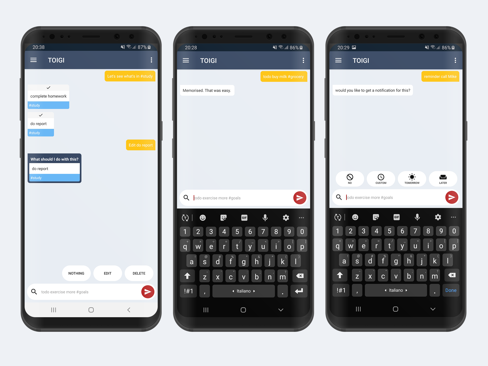

# TOIGI
> What if todo's and reminders were as easy as sending a message?

## Preview

## Was is it about?

This is a side-project from 2016, a very simple bot/assistant for todos and reminders on-the-fly. 
The main idea was to have a single chat-UI in which todos and reminders can be created by sending messages to the bot e.g. "todo call Tom" and the bot would interact with the user by replying accordingly e.g. "todo has been saved". Like the previous example all other actions can be perfomed via command-like messages (see below features).

### Features

- [x] Save a new todo
- [x] Set a new reminder (date and time) and receive notification for chosen date/time
- [x] Modify an existing todo/reminder
- [x] Automatically create a new folder/label when hashtags are used
- [x] Detecs links and organises them in specific folder called 'links'
- [x] Delete todo/reminder
- [x] View all todos/reminders
- [x] Folder/label view
- [x] Preview of recently used hashtags while typing (autocomplete)

### Main Android components used

* Activities
* Intents
* Broadcast receivers
* Notifications

### Try the app

> Google Play and the Google Play logo are trademarks of Google Inc.

### Authors

* Luigi Manco 

